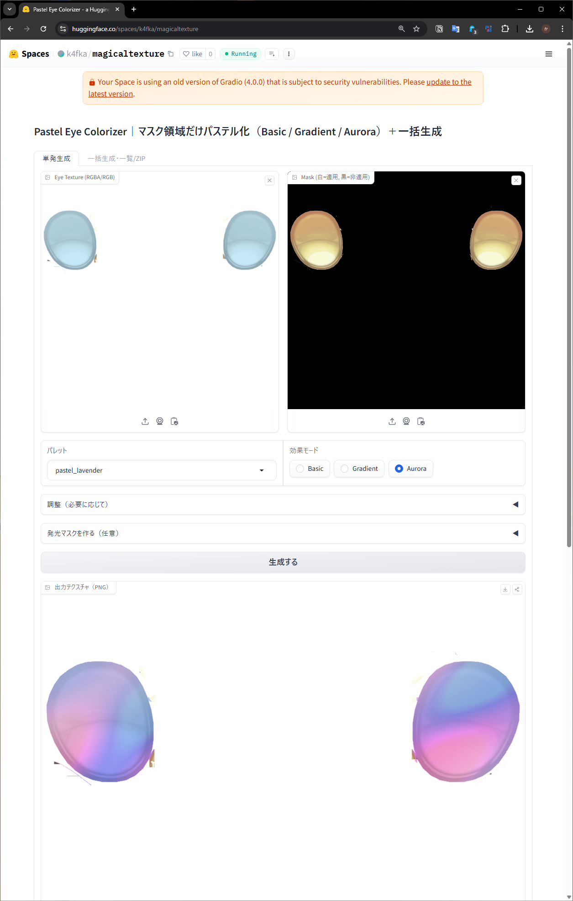

# magicaltexture へようこそ

- 利用URL（実行サブドメイン）: https://k4fka-magicaltexture.hf.space
- スペースページ（紹介/埋め込み表示）: https://huggingface.co/spaces/k4fka/magicaltexture

使い方
- 上の実行URLにアクセスして、テクスチャとマスクをアップロードし、好みのパステルカラーや効果を選ぶだけで生成・ダウンロードできる。ブラウザだけで動作するため、インストールは不要。

# 使い方クイックガイド（README 追記用）

## 1) マスクの作り方（超かんたん版）
- 目的: 瞳の「色を変えたい部分＝虹彩」を白、その他を黒にした白黒マスクを作る
- 手順
  1. 目のテクスチャ画像（PNG 推奨）を画像編集ソフトで開く（Photoshop/GIMP/ClipStudio など）
  2. 新規レイヤーを作成し、虹彩（黒目の周りの模様の領域）を白で塗る
     - まぶた・まつ毛・白目（強膜）・影は含めない
     - 両目が並んだテクスチャなら、左右それぞれの虹彩を白で塗る
  3. 2 で塗っていない部分はすべて黒で塗りつぶす（大雑把でOK）
  4. 境界がカクつく場合は、ガウスぼかし 1–2px を軽く当てると自然
  5. 元のテクスチャと同じ解像度・同じ位置合わせで、8bit グレースケールPNGとして保存
     - キャンバスサイズは元画像と同一にする（本アプリ側でも自動リサイズはするが、同一サイズが最も確実）

## 2) アップロードのやり方
- Eye Texture: 元の目テクスチャ（RGB/RGBA）
- Mask: 上で作った白黒マスク（白＝適用／黒＝非適用）
- パレットとモードを選ぶ
  - パレット: pastel_cyan / pink / lavender / mint / peach / lemon / coral / sky
  - 効果モード: Basic（色置換）／Gradient（中心→外周グラデ＋上部ハイライト）／Aurora（色相ゆらぎ）
- 必要に応じて調整
  - 明度保持率 keep_value（元の明るさをどれだけ残すか）
  - 彩度スケール sat_scale（鮮やかさの微調整。くすむ時は 1.1–1.3）
  - Gradient のハイライト量、Aurora の揺らぎ強度
- 発光を使う場合は「Emissionマスクを出力」をオンにしてリングの内外半径／ぼかしを調整
- 「生成する」を押す

## 3) 結果の受け取り方
- 画面下部に「出力テクスチャ（PNG）」が表示される
  - 画像右上のダウンロードアイコンから RGBA PNG を保存
- 「Emissionマスク（任意）」をオンにしていた場合は、8bit グレースケールPNGも同様に保存
- ファイル名例
  - eye_color_pastel_mint_gradient.png
  - eye_emission_mask.png

## 4) Unity（lilToon）での適用
- 前提: 生成した PNG を Unity プロジェクトへインポート
- マテリアル設定
  1. lilToon のマテリアルを作成（Shader: lilToon）
  2. Main Texture（Albedo）に「出力テクスチャ（PNG）」を割り当て
     - マテリアルの色（Color）は白にして色味を変えない
  3. 目メッシュ（Renderer）にこのマテリアルを割り当て
- Emission（発光）を使う場合
  1. マテリアルの「Emission」を有効化（Use Emission）
  2. Emission Mask（または Emission Map/Mask のスロット）に「Emissionマスク（PNG）」を割り当て
  3. Emission Color を HDR で好みの色に設定、Intensity/Strength を上げて発光量を調整
     - まずは Color を白～ややシアン、Intensity 1–3 程度から調整開始
- 仕上がりが暗い／薄いときの対処
  - 生成時に sat_scale を上げる（1.1–1.3）
  - keep_value を少し下げて（0.6 前後）パステル側の明るさを寄与
  - マスク縁が目立つ場合はマスク境界を 1–2px ぼかす

## 5) トラブルシュート（短縮版）
- 色がずれる／位置が合わない: マスク画像の解像度と位置が元テクスチャと一致しているか確認（できれば同一解像度で作成）
- 端がギザギザ: マスク境界を 1–2px ぼかす
- 彩度が物足りない: sat_scale↑、Aurora の場合は strength を 0.2–0.35 目安で調整
- 発光が見えない: Emission 有効化と Mask の割り当て、HDR 色と Intensity の設定を再確認